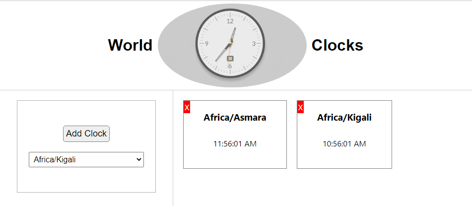

## World Clocks - Check the local time anywhere in the world

## Definition:

### This is a React web app where people can add clocks from different time zones.

### Time zones and names info are taken from the following link:

https://momentjs.com/timezone/

### Note: Don't forget to install the following package:

$ npm install moment-timezone --save

### Deployment

This React App has been deployed to AWS Amplify: [Click here to open](https://main.d1fgkv8kdgsh34.amplifyapp.com/) to see the UI.
